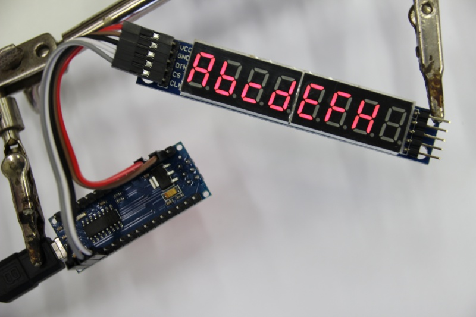

# 7-Seg8-DigitMAX7219

Projekt ukazující zapojení 7 segmentového displaye pomocí řadiče MAX 7219. Po
spuštění postupně zobrazuje čísla a znaky abecedy zobrazitelné na 7 segmentovém
displayi.

## Ukázka



## Zapojení

```

Arduino    Display
 (5V) ---- (VCC)
 (GND) --- (GND)
 (D10) --- (CS)
 (D11) --- (CLK)
 (D12) --- (DIN)

```
