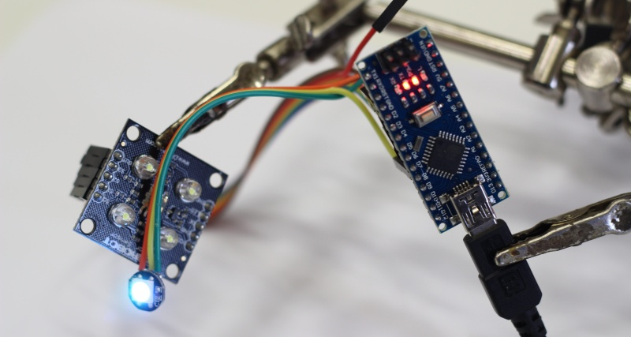

# Color Sensor

Projekt používá barevný senzor od firmy DF Robot ve spojení s "inteligentní" LED
diodou WS2812B (taktéž označované jako NeoPixel). Po spuštění, senzor čte
ambientní barvu (bez použití přisvětlovacích diod) a stejnou barvu zobrazuje na
připojené RGB LED.

## Ukázka



## Zapojení

```

Arduino        DFRobot Color Sensor        WS2812B

 (5V) --------------- (VCC) --------------- (VCC)
 (GND) -------------- (GND) --------------- (VSS)
 (D8) ------------------------------------- (DIN)
 (D2) --------------- (OUT)
 (D3) --------------- (SD)
 (D4) --------------- (S1)
 (D5) --------------- (S2)
 (D6) --------------- (S3)

```