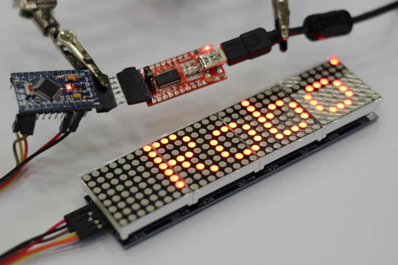

# MatrixLCD

Projekt ukazuje jednoduché zapojení maticových LCD s řadičem MAX7219.

## Ukázka 



## Zapojení

```

Arduino    Display
 (5V) ---- (VCC)
 (GND) --- (GND)
 (D10) --- (CS)
 (D11) --- (CLK)
 (D12) --- (DIN)

```