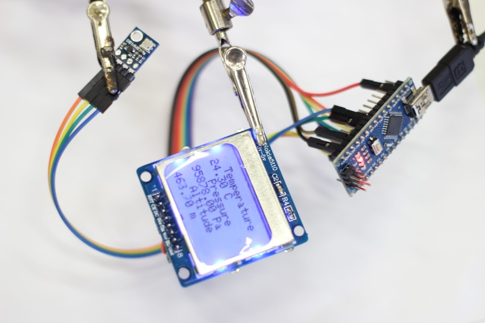

# Nokia5110LCD

Ukázka zapojení displaye z Nokie 5110 a zobrazování hodnot z tlakového čidla
BMP180.

## Ukázka 



## Zapojení

```

Arduino    Display      BMP180
 (3V3) --- (VCC)
 (5V) ---- (BLK)
 (D2) ------------------ (VIN)
 (GND) --- (GND) ------- (GND)
 (A4) ------------------ (SDA)
 (A5) ------------------ (SDC)
 (D3) ---- (RST)
 (D4) ---- (CE)
 (D5) ---- (DC)
 (D6) ---- (DIN)
 (D7) ---- (CLK)

```