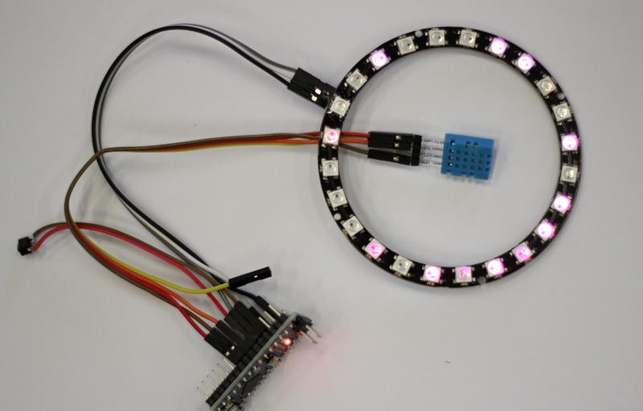

# SmartLED

Ukázka použití "inteligentních" LED WS2812B a
vlhostního čidla DHT11. Tlačítkem se přepíná mezi módy 
měření vlhkosti (modrá barva), teploty (červená barva) a
barevného prolínání.

## Ukázka 



## Zapojení

```

Arduino    LedRing      DHT11    Tlačítko
 (5V) ---- (5V)
 (GND) --- (GND) ------- (GND) -- (1) -- (100n kondenzátor) -+
                                                             |
 (D3) --------------------------- (2) -----------------------+
 (D6) ------------------ (1)
 (D4) ------------------ (2)
 (D5) ------------------ (4)
 (D2) ----- (DIN)

```