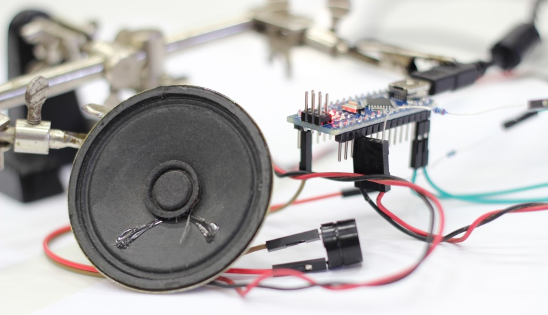

# Sound

Ukázka použití reproduktoru a pieza

## Ukázka 



## Zapojení

```

Arduino            Reproduktor     Piezo
 (GND) ------------ (1) ----------- (-)
 (D11) -- <220R> -- (2)
 (D12) ---------------------------- (+)

```